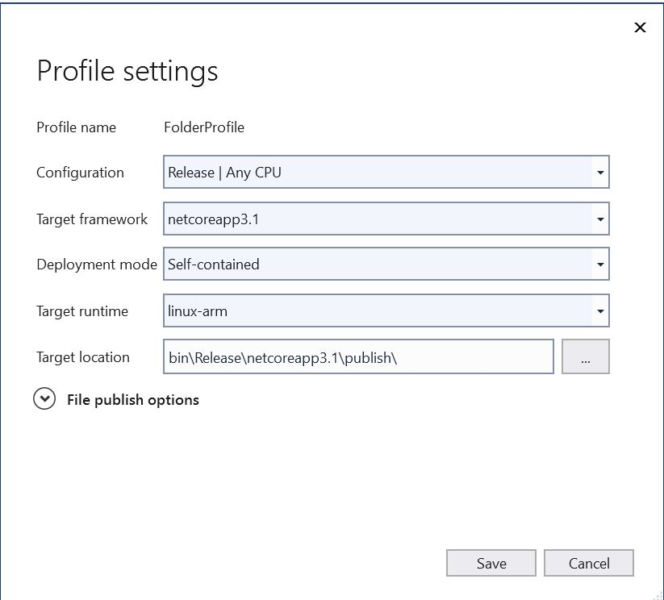

# End to end experience with .NET, Azure IoT and Raspberry PI + SenseHat

In this experience, we are going to:

Implement in .net core 3.1, a PnP device who publish temperature to Azure IoT Hub from temperature sensor (SenseHat on RAspberry Pi 3)


## Setup and pre requisite

### On the Device

1. Setup System on your Raspberry Pi3, as usual following this steps : [see the official raspberry pages](https://www.raspberrypi.org/software/) 
1. Plug your SenseHat on your Raspberry PI, an start it with screen, mouse and keyboard connected
1. Enable, in Raspberry Pi Configuration: SSH, I2C 
1. create your dev/test environment (create a folder "SenseHat" that will receive copy of your work)
1. Install .net core 3.1 on the Pi (optional, we'll produce all the code needed in the publish folder)
1. note the IP address of your PI.

### On your Dev Machine (assuming it is Windows 10, but Linux or Mac welcome)

1. Install VSTudio (with .NET and .NET Core)
1. Install VSCode
1. Clone this [tutorial repo](https://github.com/ericmitt/IotPnp/tree/master/SenseHat)
1. The solution use 2 nuget package:
    1. Iot.Device.Bindings
    1. Azure IoT sdk  
1. Clone .net IOT Repo (optional, but you'll need their dll: Iot.Device.Bindings.dll)
1. Clone Azure IoT C# SDK (optional, but you'll need to install the  latest version of the device [SDK](https://www.nuget.org/packages/Microsoft.Azure.Devices/).

#### On the Azure portal
Prepare a Hub with a new device
(For example IoTHub42, SenseThermostat)

Note the following:
1. cnx string for Iot Hub (to be used in IoT Explorer)
1. cnx string for the Device (to be used in the project code)


To do Later: Add and cnx Option for DPS (so we can use the device with IoT Central)

## Running the code

Open the Visual Studio solution (SenseThermostat.sln)
Set your device connection string (program.cs)
Build your solution (check it is successful)
Publish your application in a local folder
1. set the target runtime to : Linux-arm
1. set the deployemnt mode to : self contained (in case the .net core is not installed on the Pi) 
    
1. copy the publish folder on your Pi
    You can use scp: 
    ```dotnetcli
    scp -r * pi@10.0.0.137:/home/pi/sensethermostat
    ```
1. On your Pi, open a Terminal
1. Navigate to the publish folder and run via:
1. ```dotnetcli
   ./SenseThermostat 
   ```


Show/explain the code
    .net iot usage
    design a pnp model
    azure iot sdk hub usage


## Run and Test
How to run the code produced?
How to debug this code?
