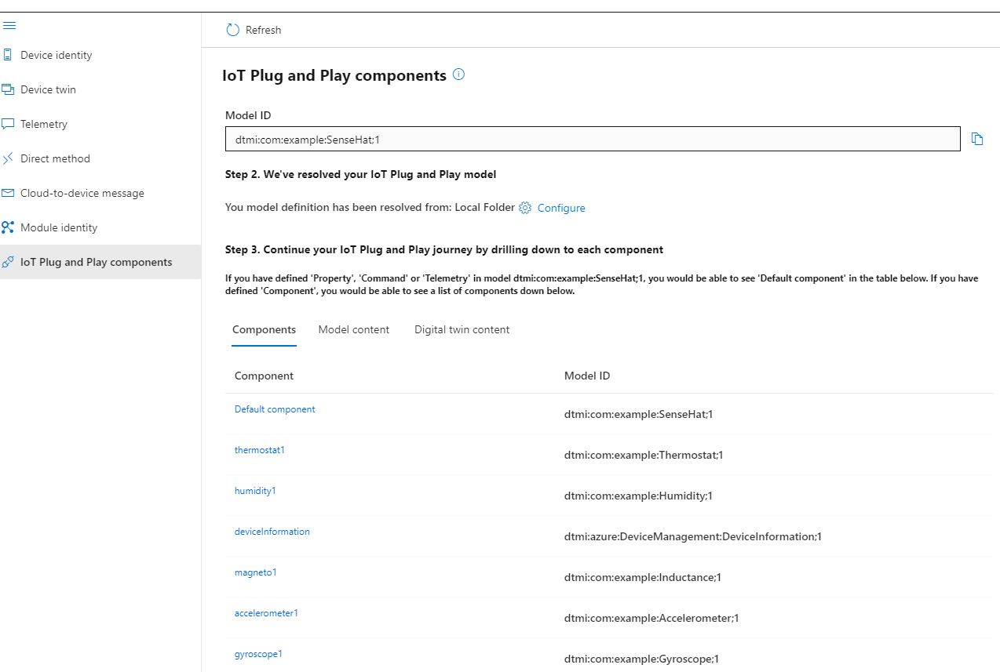
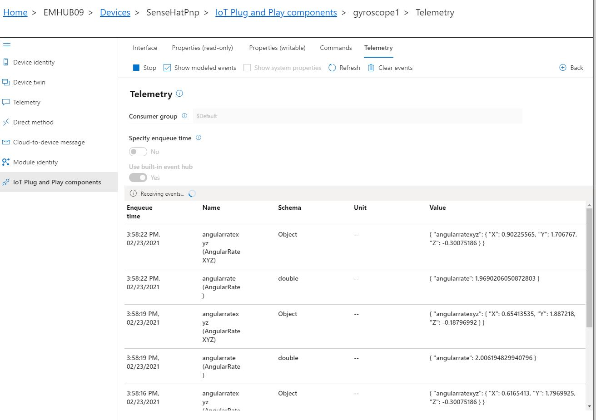
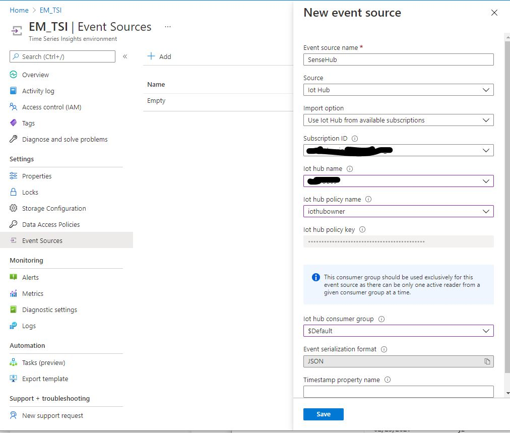
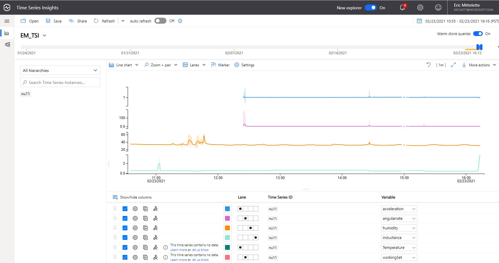

# Azure IoT Plug and Play with .NET core, Azure IoT and Raspberry PI SenseHat

Create a Plug and Play devices with .NET core 3.1 running on Raspberry PI and manipulating real sensors data.

Publish temperature to Azure IoT Hub from temperature sensor (SenseThermostat using Thermostat DTDL model)
Publish 7 sensor data as PnP components (Custom DTDL models) 

## Setup and pre requisite

### On the Device

1. Setup System on your Raspberry Pi3, as usual following this steps : [see the official raspberry pages](https://www.raspberrypi.org/software/) 
1. Plug your SenseHat on your Raspberry PI, an start it with screen, mouse and keyboard connected
1. Enable, in Raspberry Pi Configuration: SSH, I2C 
1. create your dev/test environment (create a folder "SenseHat" that will receive copy of your work)
1. Install .net core 3.1 on the Pi (optional, we'll produce all the code needed in the publish folder)
1. note the IP address of your PI.

### On your Dev Machine (assuming it is Windows 10, but Linux or Mac welcome)

1. Install VSTudio (with .NET and .NET Core)
1. Install VSCode
1. Clone this [tutorial repo](https://github.com/ericmitt/IotPnp/tree/master/SenseHat)
1. The solution use 3 nuget package:
    1. Iot.Device.Bindings
    1. Microsoft.Azure.Devices and Microsoft.Azure.Devices.Client (C# Azure IoT Hub SDK)
1. Clone .net IOT Repo (optional, as you have the dll via the nuget package)
1. Clone Azure IoT C# SDK (optional, as you have the dlls via the nuget package [SDK](https://www.nuget.org/packages/Microsoft.Azure.Devices/).

#### On the Azure portal
Prepare a IoT Hub with a new device
(For example IoTHub42, SenseThermostat)

Note the following:
1. cnx string for Iot Hub (to be used in IoT Explorer)
1. cnx string for the Device (to be used in the project code)

To do Later: Add and cnx Option for DPS (so we can use the device with IoT Central)

## Running the senseThermostat sample

Open the Visual Studio solution (SenseThermostat.sln) from your clone.
Set your device connection string (in program.cs, easy to copy from IoTExplorer)
Build your solution (check if it is successful)
Publish your application in a local folder
1. set the target runtime to : Linux-arm
1. set the deployemnt mode to : self contained (in case the .net core is not installed on the Pi) 
    
1. copy the publish folder on your Pi
    You can use scp: 
    ```dotnetcli
    scp -r * pi@10.0.0.137:/home/pi/sensethermostat
    ```
1. On your Pi, open a Terminal
1. Navigate to the publish folder and run the code via:
1. ```dotnetcli
   ./SenseThermostat 
   ```
Voila! your device is connected and send real sensor data to the Hub...

## Running the SenseHatPnp sample
Follow the same steps as above but with SenseHatPnP as the default project:
1. set the target runtime to : **Linux-arm**
1. set the deployemnt mode to : self contained (in case the .net core is not installed on the Pi) 
    
1. copy the publish folder on your Pi
    You can use scp: 
    ```dotnetcli
    scp -r * pi@10.0.0.137:/home/pi/sensehatpnp
    ```
1. On your Pi, open a Terminal
1. Navigate to the publish folder and run via:
1. ```dotnetcli
   ./SenseHatPnp 
   ```
Voila! your device is connected and send real sensor data to the Hub...

## Run and Test with IoT Explorer
Now that the code is running you can use:
IoTExplorer to look at the properties, command and telemetry. 

Note that each component has its own telemetry, that you can see in the IoT Plug and Play tab. 

IoTExplorer can resolve models from a local directory, you can specify it in Home|IoT Plug and Play Settings.

The SenseHatPnP sample list of components in IoT Explorer


When looking at telemetry, navigate to the component you are interested in and then go to the telemetry tab to start listening:



## Run and Test with TSI
You can visualize data in TSI.
First create a TSI instance from the Azure Portal (more detailed steps to come)
In your TSI Instance, add your IoT Hub as Event Source: 



Select your data series and field to be displayed :



